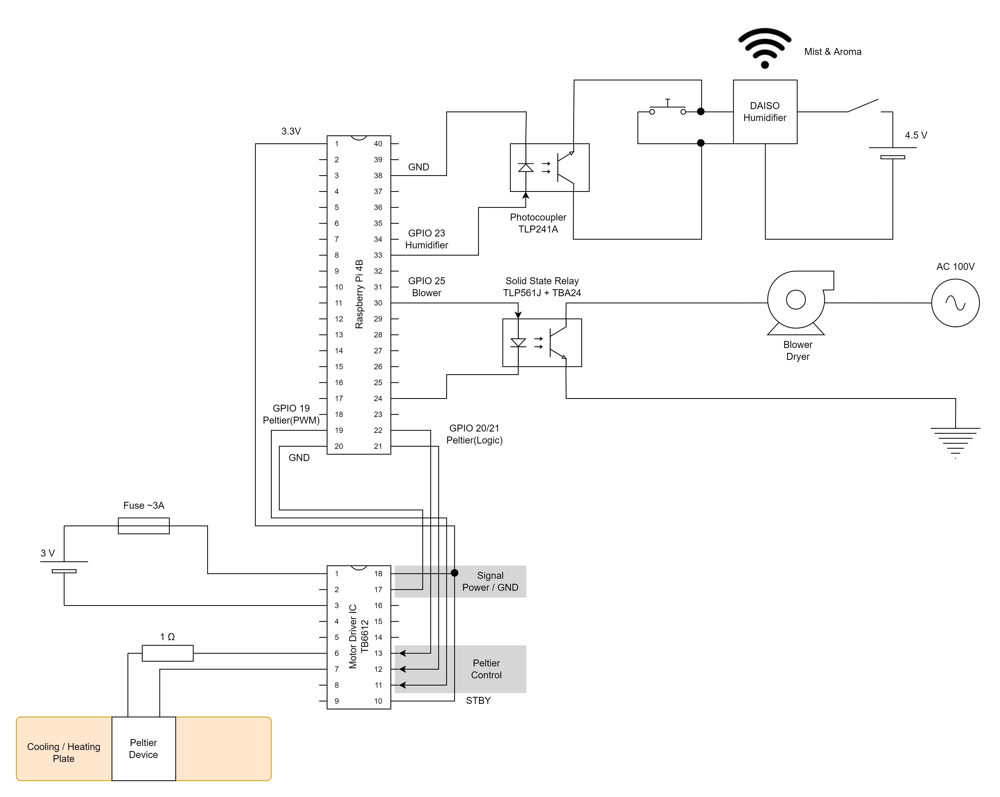

# 汎用五感伝達機構 ウユンプニオン 零号機


*──── 最低だ...俺って...*

## 概要


- **汎用五感伝達機構 ウユンプニオン 零号機**(通称: **UYU 零号機**)
- **人体刺激計画**の完遂のため、五感に多彩な刺激を与えるインタフェースを提供します
- 冷却、加熱、送風、etc ...


## アーキテクチャ

### 全体像


### ウユンプニオン・コア

- Raspberry Pi から各マニピュレータを駆動する際の回路図を以下に示します



#### ウェルノウンピン

- 各マニピュレータを制御するGPIOピンはマニピュレータごとに固定とし、新たなマニピュレータを接続する際は以下に示すピン番号以外を用いてください

|ピン番号|目的|
|:--|:--|
|19|ペルチェ素子の強さ(PWM)|
|20|ペルチェ素子の発熱(冷却とは排他)|
|21|ペルチェ素子の冷却(発熱とは排他)|
|23|加湿器の噴霧 ※1|
|25|ブロワーの駆動|

- ※1 加湿器のスイッチングは本来モーメンタリスイッチのため、0.5秒を目安に信号をオフにしてください
  - なお、加湿器はスイッチをオンにするごとに 電源オフ → 常時噴霧 → 3秒間隔で噴霧 → 電源オフ を繰り返します

### ディレクトリ構造

```
├ .vscode               Visual Studio Codeの設定
├ ansible
│ ├ hosts               Ansibleの接続先の設定
│ ├ roles               Ansibleの各タスク
│ ├ ansible.cfg         Ansible自体の挙動の設定
│ ├ infra.yml           Ansibleで設定を流すためのエントリーポイント
├ images
├ proxy
│ ├ api.toml            リバースプロキシ(Traefik)の動的設定
│ ├ docker-compose.yml  リバースプロキシ(Traefik)のDocker周りの設定
│ ├ traefik.toml        リバースプロキシ(Traefik)の静的設定
├ src
│ ├ drivers             ウユンプニオン・ドライバの制御スクリプト
│ ├ middlewares         カスタムミドルウェア
│ ├ routes              APIの各エンドポイント
│ ├ schemas             レスポンスのスキーマ
│ ├ app.py              アプリケーションのエントリーポイント
│ ├ gunicorn.conf.py    本番環境で使用するGunicornの設定
│ ├ Makefile            本番環境で使用するコマンド群の定義
│ └ settings.py         環境変数、グローバル変数
├ test                  検証サーバ(Vagrant)の設定
└ README.md
```

## APIの環境構築(開発環境)

- 以下の用途で使用する場合にこの手順が必要です
    - APIを開発する場合
    - APIの動作を検証する場合
    - API仕様(Swagger/Redoc)を閲覧したい場合

- 以下のソフトウェアが必要です
    - Python又はPyenv(Pythonのバージョンは3.9系)
    - Pipenv
    - Visual Studio Code
        - 開発しない場合(APIを動作させるのみの場合)は必要ありません
        - 本リポジトリには[VSCode上でFlake8(リンター)とBlack(フォーマッター)を動作させるための設定](./.vscode/settings.json)が含まれています

```bash
$ cd src
$ cp .env.example .env              # UYUNPUNION_TOKENの設定が必須
$ pipenv install --dev
$ pipenv shell
$ pipenv run dev                    # サーバの起動
$ pipenv run dev --port 8081        # ポート指定する場合
$ pipenv run dev --host 0.0.0.0     # ホスト指定する場合(0.0.0.0の場合、プライベートIPでのアクセスが可能となる)
$ open localhost:8080               # API
$ open localhost:8080/docs          # Swagger
$ open localhost:8080/redoc         # Redoc
$ python drivers/blower.py start    # ドライバ単体で実行させる場合
```

## APIの環境構築(本番環境)

- 以下の用途で使用する場合にこの手順が必要です
    - 本番環境にAPIをデプロイする場合
    - ※ 主にMakefile経由で操作します

```bash
$ cd src
$ cp .env.example .env  # UYUNPUNION_TOKEN、ENV=prodの設定が必須
$ pipenv install
$ make up               # サーバの起動
$ make reload           # サーバの再起動(graceful)
$ make down             # サーバの停止
$ make ps               # サーバのプロセスの確認
```

## リバースプロキシの環境構築

- 以下の用途で使用します
    - リバースプロキシ
    - TLS終端
    - ※ 主に本番環境で使用するものです

- 以下のソフトウェアが必要です
    - Docker
    - Docker Compose

```bash
$ cd proxy
$ docker compose up -d
$ docker compose ps
$ docker compose down
$ open localhost:8080                                                   # ダッシュボード
$ curl -H "Host: uyunpunion.uyupun.tech" -L "localhost:80/ping"         # 疎通確認
$ curl -H "Host: uyunpunion.uyupun.tech" -L "<private ip address>/ping" # 疎通確認
```

## 検証サーバの環境構築

- 以下の用途で使用します
    - Ansibleのテスト
    - より本番環境に近い環境での動作確認
        - ※ Debian 11(bullseye)が動作します

- 以下のソフトウェアが必要です
    - Homebrew
    - VirtualBox
    - Vagrant

```bash
$ cd test
$ vagrant up
$ vagrant ssh
$ vagrant status
$ vagrant halt
$ vagrant reload
$ vagrant destroy
$ ssh-keygen -R 192.168.56.10   # 検証サーバを作り直した場合に実行が必要
```

## Ansibleによる設定の流し込み

- 以下の用途で使用します
    - 本番環境で使用するラズパイに設定を流し込む
    - その前段階として検証サーバに設定を流し込む

- 以下のソフトウェアが必要です
    - Python又はPyenv(Pythonのバージョンは3.9系)
    - Pipenv

- 以下のファイルが必要です
    - `ansible/roles/user/files/id_ed25519`

```bash
$ cd ansible
$ chmod 600 roles/user/files/id_ed25519                     # 秘密鍵のパーミッションを変更しないとSSH接続できないため
$ touch VAULT_PASSWORD                                      # Ansible Vaultのパスワードを設定する
$ pipenv install
$ pipenv shell
$ ansible all -i hosts/test -m ping                         # 疎通確認
$ ansible-playbook -i hosts/test infra.yml --list-tasks     # タスク一覧
$ ansible-playbook -i hosts/test infra.yml --syntax-check   # 構文エラーのチェック
$ ansible-lint infra.yml                                    # リンターの実行
$ ansible-playbook -i hosts/test infra.yml --check --diff   # ドライラン
$ ansible-playbook -i hosts/test infra.yml                  # 実行
$ ssh -i roles/user/files/id_ed25519 takashi@192.168.56.10  # SSH接続
```


*おめでとう ────*
