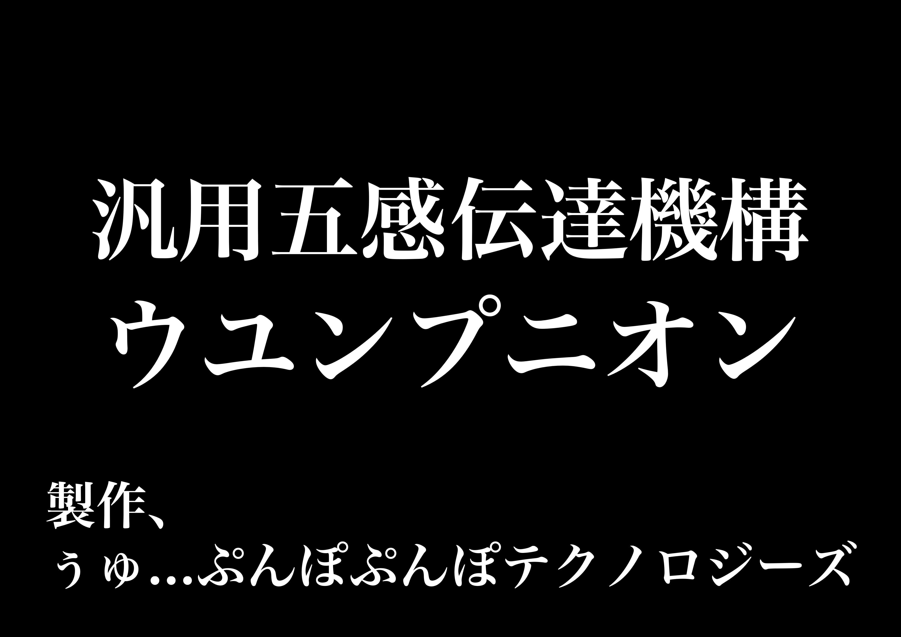
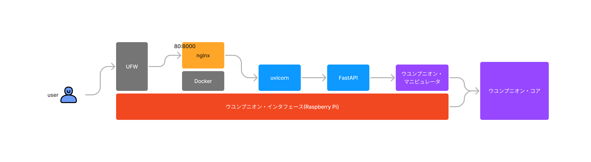
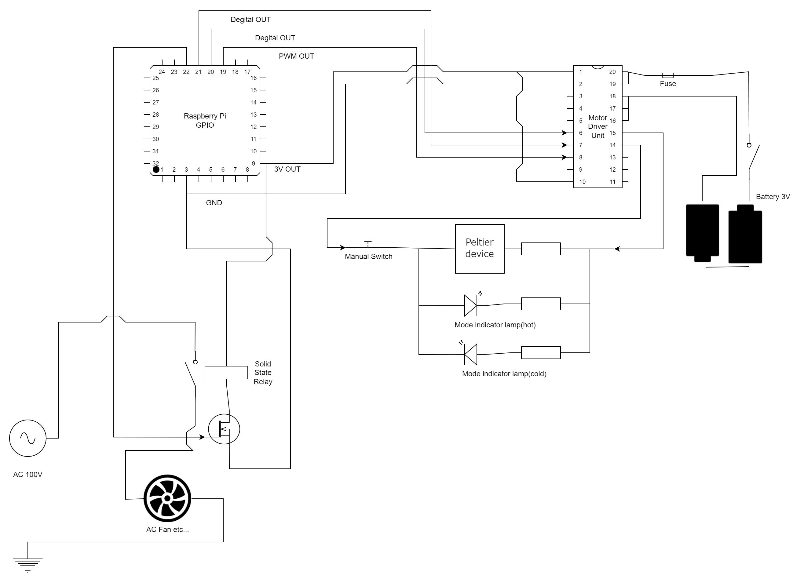
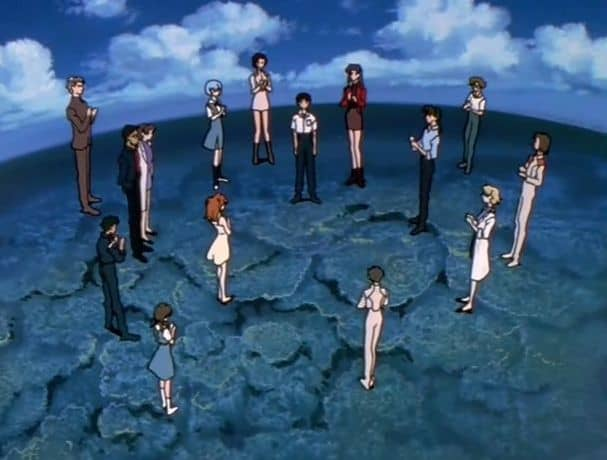

# 汎用五感伝達機構 ウユンプニオン 零号機


*──── 最低だ...俺って...*

## 概要



- 汎用五感伝達機構 ウユンプニオン 零号機(通称: UYU 零号機)
- 人体刺激計画の達成に向け、五感に多彩な刺激を与えるためのインタフェースを提供します
- 冷却、加熱、送風、etc ...

## アーキテクチャ

### 全体像



### ウユンプニオン・コア



### ディレクトリ構造

```
├ .vscode           Visual Studio Codeの設定
├ ansible           Ansibleの設定(TLS終端、リバプロ、WSGI、ASGI等)
├ images
├ src
│ ├ manipulator     ウユンプニオン・コアの制御スクリプト
│ ├ routes          ルーティング
│ ├ schemas         レスポンスのスキーマ
│ ├ app.py          APIのエントリーポイント
│ └ settings.py     環境変数
└ vagrant           検証用途で使用するVagrantの設定
```

## システム要件

- Visual Studio Code
- pipenv

## 環境構築

```bash
$ cd src
$ cp .env.example .env
$ pipenv install --dev
$ pipenv shell
$ python app.py
$ open localhost:8080       # API
$ open localhost:8080/docs  # OpenAPI
$ open localhost:8080/redoc # Redoc
```



*おめでとう ────*
