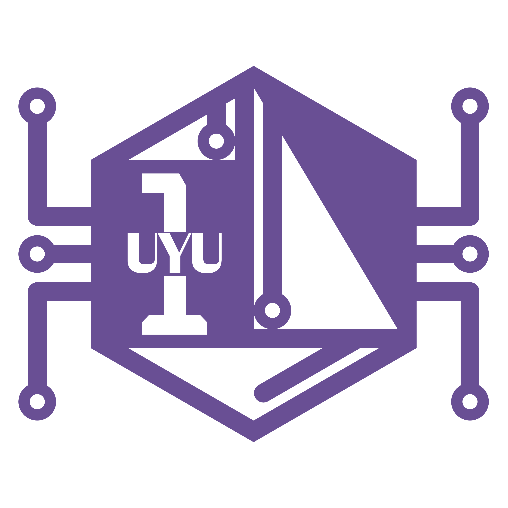

# 汎用五感伝達機構 ウユンプニオン 初号機

*──── 最低だ...俺って...*

---

- **汎用五感伝達機構 ウユンプニオン 初号機**(通称: **UYU 初号機**)
- **人体刺激計画**の完遂を目的とし、五感に多彩な刺激を与えるインタフェースを提供します
- e.g. 冷却、加熱、送風、etc ...

## ドキュメント

- [アーキテクチャ](docs/arch.md)
- [ディレクトリ構造](docs/dirs.md)
- [バージョニング](docs/versioning.md)
- [環境構築](docs/instlation.md)

---

*おめでとう ────*
