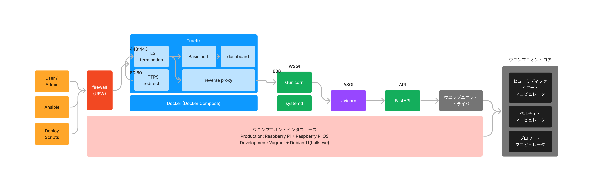

# 汎用五感伝達機構 ウユンプニオン 零号機


*──── 最低だ...俺って...*

## 概要


- **汎用五感伝達機構 ウユンプニオン 零号機**(通称: **UYU 零号機**)
- **人体刺激計画**の完遂のため、五感に多彩な刺激を与えるインタフェースを提供します
- e.g. 冷却、加熱、送風、etc ...


## アーキテクチャ

### 全体像



### ウユンプニオン・コア

- Raspberry Piから各マニピュレータを駆動させる際の回路図を以下に示します


- 各マニピュレータを制御するGPIOピンはマニピュレータごとに固定とし(ウェルノウンピン)、新たなマニピュレータを接続する際は以下に示すピン番号以外を用いてください

|ピン番号|用途|
|:--|:--|
|19|ペルチェ素子の強さ(PWM)|
|20|ペルチェ素子の発熱(冷却とは排他)|
|21|ペルチェ素子の冷却(発熱とは排他)|
|23|加湿器の噴霧 ※1|
|25|ブロワーの駆動|

- ※1 加湿器のスイッチングは本来モーメンタリスイッチのため、0.5秒を目安に信号をオフにしてください
  - なお、加湿器はスイッチをオンにするごとに 電源オフ → 常時噴霧 → 3秒間隔で噴霧 → 電源オフ を繰り返します

## ディレクトリ構造

```
├ .vscode                         Visual Studio Codeの設定
├ api
│ ├ drivers                       ウユンプニオン・ドライバの制御スクリプト
│ ├ middlewares                   カスタムミドルウェア
│ ├ routes                        APIの各エンドポイント
│ ├ schemas                       レスポンスのスキーマ
│ ├ app.py                        アプリケーションのエントリーポイント
│ ├ generate_uyunpunion_token.py  UYUNPUNION_TOKENの生成スクリプト
│ ├ gunicorn.conf.py              本番環境で使用するGunicornの設定
│ ├ Makefile                      本番環境で使用するコマンド群の定義
│ └ settings.py                   環境変数、グローバル変数
├ deploy                          デプロイスクリプト関連
│ ├ get_server_ssh_key.sh         デプロイ対象のサーバから公開鍵を取得するスクリプト
│ ├ init.sh                       初回デプロイ時に使用するスクリプト
│ ├ tag.sh                        タグ打ちに使用するスクリプト
│ └ update.sh                     2回目以降のデプロイ時に使用するスクリプト
├ devel                           検証サーバ(Vagrant)の設定
├ images
├ playbook
│ ├ roles                         Ansibleの各タスク
│ ├ ansible.cfg                   Ansible自体の挙動の設定
│ ├ devel                         Ansibleの接続先の設定(開発環境)
│ └ site.yml                      Ansibleで設定を流すためのエントリーポイント
├ proxy
│ ├ certs                         TLS終端に使用する証明書と秘密鍵
│ ├ config
│ │ ├ api.toml                    API関連の動的設定
│ │ ├ dashboard.toml              ダッシュボード関連の動的設定
│ │ └ http.toml                   HTTPからHTTPSへのリダイレクトの動的設定
│ ├ compose.yml                   Docker周りの設定
│ └ traefik.toml                  リバースプロキシ(Traefik)全体の静的設定
└ README.md
```

## バージョニング

- バージョニングはセマンティックバージョニングを参考にしつつも、完全には準拠していません
- 大まかな基準としては以下の通りです
  - 互換性を損なう変更はメジャーバージョンを上げる
  - 後方互換性のある機能追加はマイナーバージョンを上げる
  - 後方互換性のあるバグ修正はパッチバージョンを上げる

## 環境構築

- 以下の全ての環境構築を行う必要はありません
- 必要な環境構築のみ選択して行ってください

### APIの環境構築

- ※ 環境構築の最小構成で、API単体の構築のみを行います
- [APIの環境構築](./api/README.md#apiの環境構築開発環境)

### 統合開発環境の環境構築

- ※ 統合開発環境は本番環境とほぼ同等の環境を開発環境で再現した環境を指します
- [検証サーバの環境構築](./devel/README.md)
- [Ansibleによる設定の流し込み](./playbook/README.md)
- [デプロイスクリプト](./deploy/README.md)

### 本番環境の環境構築

- [Ansibleによる設定の流し込み](./playbook/README.md)
- [デプロイスクリプト](./deploy/README.md)

---


*おめでとう ────*
